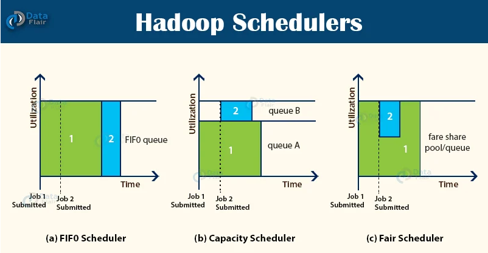

# Hadoop core: HDFS and YARN

## The Hadoop Ecosystem

- A stack of **Open Source softwares** offering all the functionalities needed to build a [Data Lake](https://en.wikipedia.org/wiki/Data_lake) and exploit the data stored in it. Most of the Hadoop projects are maintained by the [Apache Software Foundation](https://apache/org) and can be found on [their GitHub](https://github.com/apache).
- Nearly are built using **Java** or at least run in the **JVM** (Java Virtual Machine)
- Preferred execution environment: **Linux**

## Hadoop ecosystem projects

- Distributed Filesystem: HDFS
- Resource Manager: YARN
- Execution Engines: MapReduce, Tez, Spark
- Warehouse / SQL: Hive
- NoSQL DB: HBase
- And other stuff

## Apache Hadoop core

- **HDFS:** Hadoop Distributed File System
- **YARN:** Yet Another Resource Negotiator
- **MapReduce:** Big Data applications framework

## What is HDFS?

The **Hadoop Distributed File System**:

- Data stored on **hundred/thousands of nodes**
- Data is **replicated**:
  - Avoid data loss
  - Optimize access
- Support **huge files**: typical size from GB to TB
- Focus on **high throughput** vs low latency
- **Unix-like** file system (tree + rwx permissions)

## Master / Worker architecture

- Master component coordinates workers
- Worker components do the job (compute)

## HDFS: Files storage

- One file is divided into **blocks**
  - 1 block = **128 MB** (max)
  - Each block is **replicated** (x3 by default)
- E.g. 1 file of 420 MB =
  - 3 blocks of 128 MB + 1 block of 36 MB
  - The file actually takes 1.26 GB of disk in the cluster

## HDFS: Architecture

- **NameNode** (= master): Handles file system metadata. For each file, it knows:

  - The blocks that compose the file
  - The position of each block in the cluster

- **DataNodes** (= workers):

  - Store the blocks on disks (hardware optimization)
  - Handle read/write operations

- **Secondary NameNode**: Builds HDFS checkpoints (= FSImage) from NameNode edit logs

  - Enables faster start-up of the NameNode in case of restart
  - Only a helper node, it is not compulsory

## HDFS: Data replication example

## HDFS: Client interactions

## HDFS: Important properties

- **WORM** = Write Once Read Many: no update on files
- **Rack awareness**
- NameNode stores all the metadata in RAM => **small files problem**

## HDFS: Sum up

Components:

- **NameNode**: tracks blocks/files in the cluster
- **DataNode**: stores blocks + handles read/write operations
- **Secondary NameNode**: builds checkpoints (FSImage) based on edit logs

What is wrong with this architecture? => **SPOF (Single Point of Failure)**

## High Availability

High Availability: more than 1 master (1 **active** + N **standby**)

- Avoid **split-brain problem**: consensus via **ZooKeeper** (quorum)
- Avoid Secondary NameNode SPOF via shared edits = **JournalNodes**

## HDFS: High Availability mode

## HDFS HA: Sum up

Components:

- **NameNode**: 1 active NN and 1+ standby NN
- **DataNodes**: store blocks + handles read/write operations
- **JournalNodes**: keep track of every action and build the FSImage

## What is YARN?

Yet Another Resource Negotiator:

- Cluster resource manager:

- - Handles the **RAM** and the **CPU** of workers
  - Allocates resources to applications

- Job monitoring

## YARN: Architecture

- **ResourceManager** (= master):

  - Schedules applications based on available resources
  - Allocating resources to the applications

- **NodeManager** (= worker): Handle resources on one worker

## YARN: Applications

Application = single job or DAG of jobs

Components (JVMs) of an application:

- **ApplicationMaster**: 

  - First container of each application to be allocated (by ResourceManager)
  - Runs on one of the workers
  - It requests resources for other containers
  - It monitors the process

- **Containers**: They do the computing

## YARN: Application lifecycle

## YARN: Job scheduling

- **FIFO scheduler**:
  - first comes first served basis
  - long jobs will occupy all the resources  
- **Capacity scheduler**:
  - two queues: one for longer and one for shorter jobs
  - if only one queue is occupied, the resources are not fully exploited
- **Fair scheduler**:
  - resources are dynamically allocated 

## Resources

- [HDFS Architecture](https://hadoop.apache.org/docs/r3.1.0/hadoop-project-dist/hadoop-hdfs/HdfsDesign.html)
- [Secondary NameNode - What it really do?](http://blog.madhukaraphatak.com/secondary-namenode---what-it-really-do/)
- [YARN scheduling](https://data-flair.training/blogs/hadoop-schedulers/)
