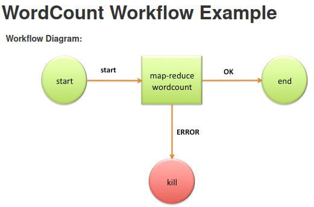

# Orchestration with Oozie

## What is OOzie?

- **workflow scheduler** for Hadoop
- it creates a **sequence of actions**, executed by Hadoop applications

Two basic types of Oozie jobs:

- **Workflow jobs**: Directed Acyclical Graphs (DAGs), specifying a sequence of actions to execute.
- **Coordinator jobs**: recurrent Oozie Workflow jobs that are triggered by time and data availability.

## DAGs of jobs

DAG consists of:

- **workflow nodes**: define the beginning and the end of a workflow (`start`, `end` and `fail` nodes) and provide a mechanism to control the workflow execution path (`decision`, `fork` and `join` nodes)
- **action nodes**: trigger the execution of a computation/processing task (example: HDFS, Hive or Spark action)
- nodes are connected by **transition arrows**



## How to write Oozie workflow?

Oozie contains three major types of configurable items:

- **Workflow**: 
    - define the sequence of actions that need to be executed. Contain details for each individual action.
    - example: `workflow.xml`

    ```xml
    <workflow-app xmlns="uri:oozie:workflow:0.4" name="drivers_ingestion">
    <global>
        <job-tracker>${jobTracker}</job-tracker>
        <name-node>${nameNode}</name-node>
    </global>

    <credentials>
        <!-- Connect to Hive. -->
    </credentials>

    <start to="create_csv_table" />

    <action name="create_csv_table" cred="hive-creds">
        <hive2 xmlns="uri:oozie:hive2-action:0.2">
        <jdbc-url>${jdbcUrl}</jdbc-url>
        <script>scripts/create_drivers_ext.hql</script>
        <param>hiveUsername=${hiveUsername}</param>
        <param>clusterUsername=${clusterUsername}</param>
        </hive2>
        <ok to="end" />
        <error to="kill_job" />
    </action>

    <kill name="kill_job">
        <message>Job failed</message>
    </kill>

    <end name="end" />
    </workflow-app>
    ```

- **Property File**: 
    - contains variables for the workflows or coordinators.
    - example: `job.properties`

    ```bash
    oozie.wf.application.path=hdfs://au/user/${clusterUsername}/oozie_wf/workflow.xml

    jobTracker=yarn-rm-1.au.adaltas.cloud:8050
    nameNode=hdfs://au
    jdbcUrl=jdbc:hive2://hive-s2-1.au.adaltas.cloud:10000/
    hivePrincipal=hive/_HOST@AU.ADALTAS.CLOUD
    oozie.use.system.libpath=true

    clusterUsername=user
    hiveUsername=hive-user
    ```

- **Coordinator**:
    - contain the mechanism of triggering workflows based on time and data availability.
    - example: `coordinator.xml`

    ```xml
    <coordinator-app name="hello-coord" frequency="${coord:days(1)}"
                  start="2009-01-02T08:00Z" end="2009-01-04T08:00Z" timezone="America/Los_Angeles"
                 xmlns="uri:oozie:coordinator:0.5">

    <!-- Definition continued... -->
    ```

## Alternatives

- [Apache Airflow](https://airflow.apache.org/)
- [Luigi](https://luigi.readthedocs.io/en/stable/)
